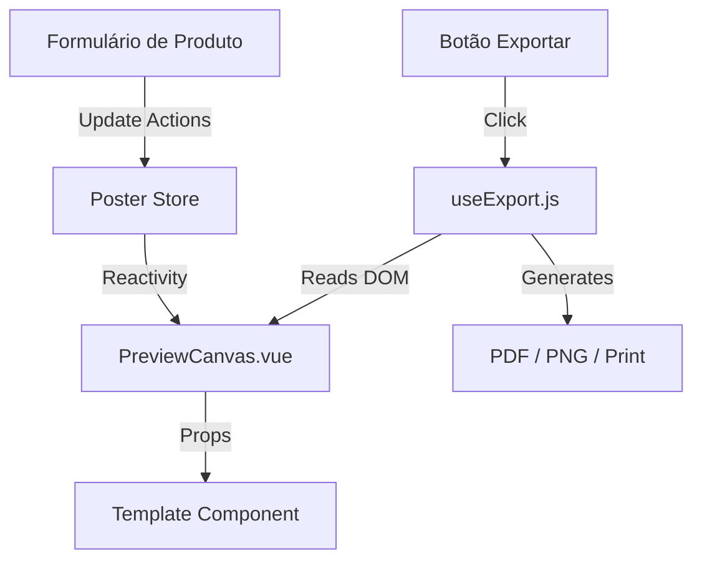

# Documentação Técnica do Sistema - Gerador de Cartazes MVP

## 1. Visão Geral

O sistema é um gerador de cartazes baseado em templates, construído como uma Single Page Application (SPA) utilizando **Vue 3** (Composition API) e **Vite**. O objetivo é permitir que o usuário preencha dados de uma oferta, visualize o resultado em tempo real e exporte para impressão (PNG/PDF).

### Stack Tecnológico
- **Core**: Vue 3
- **Build Tool**: Vite
- **UI Framework**: PrimeVue 4 + TailwindCSS
- **Gerenciamento de Estado**: Pinia
- **Geração de Imagem/PDF**: html-to-image + jspdf
- **Ícones**: PrimeIcons / Lucide Vue

---

## 2. Fluxo de Dados e Arquitetura

O fluxo principal do sistema segue um padrão unidirecional simples, gerenciado pelo **Pinia Store**.



---

## 3. Montagem do Preview (Responsável: `PreviewCanvas.vue`)

O "Preview" é a visualização em tempo real do cartaz na tela. Ele não é uma imagem estática, mas sim um componente Vue vivo, renderizado com HTML e CSS.

### 3.1. Quem monta?
O componente central é o **`src/components/PreviewCanvas.vue`**.

### 3.2. Como é montado?
1. **Container Responsivo**:
   - O `PreviewCanvas` cria um `div#poster-canvas` que atua como a "folha de papel".
   - Ele calcula o `aspect-ratio` dinamicamente com base no tamanho do papel selecionado no Store (A4, A3, A5).
   - O tamanho visual na tela é limitado por CSS (`max-width: 500px`), mas a proporção é mantida fiel à impressão.

2. **Renderização Dinâmica de Template**:
   - O componente utiliza `<component :is="...">` para renderizar o template escolhido dinamicamente.
   - O mapeamento é feito via ID do template (ex: `'oferta-destaque'` -> `OfertaDestaque.vue`).

3. **Injeção de Dados**:
   - Os dados do produto (preço, nome, descrição) vêm do `usePosterStore` e são passados via **props** (`:data="store.posterData"`) para o componente do template.

4. **Escalabilidade (Container Queries)**:
   - Os templates (ex: `OfertaDestaque.vue`) utilizam **CSS Container Queries** (`container-type: inline-size`).
   - Tamanhos de fonte e espaçamentos usam a unidade `cqw` (Container Query Width). Isso garante que o layout do cartaz seja **idêntico** independente se ele está sendo exibido pequeno na tela do celular, médio no desktop ou gigante na exportação final.

---

## 4. Geração do Resultado Final (Responsável: `useExport.js`)

A exportação transforma o componente HTML/CSS do preview em um arquivo estático (Imagem ou PDF).

### 4.1. Quem gera?
A lógica reside no composable **`src/composables/useExport.js`**.

### 4.2. Como é gerado?

O processo de geração segue 3 etapas críticas para garantir alta qualidade:

#### Passo 1: Clonagem e Preparação (`prepareCaptureElement`)
Como o preview na tela pode ter barras de rolagem ou estar em um tamanho reduzido, o sistema **não** "tira print" da tela diretamente.
1. O elemento `#poster-canvas` é clonado (`cloneNode`).
2. O clone é inserido em um container invisível (`div` fixo fora da viewport).
3. O container é forçado a ter a largura física real do papel (ex: `210mm` para A4). Isso garante que o `html2canvas` renderize o cartaz na resolução correta de impressão.

#### Passo 2: Rasterização (`html-to-image`)
A biblioteca `html-to-image` converte o DOM em SVG (foreignObject) e depois rasteriza para canvas/imagem.
- **Scale**: É mantido fator de escala para garantir nitidez (High DPI).
- **Vantagem**: Melhor suporte a CSS moderno (Flexbox, Grid) e fontes web.

#### Passo 3: Geração do Arquivo
- **PNG**: O canvas é convertido para Base64 (`toDataURL`). Um link `<a>` temporário é criado para download.
- **PDF**:
  1. O canvas é convertido para imagem (JPEG/PNG).
  2. A biblioteca `jspdf` cria um documento PDF com as dimensões exatas do papel (A3, A4, etc.).
  3. A imagem é inserida no PDF ocupando 100% da área.
- **Impressão**: Abre-se uma nova janela do navegador contendo apenas a imagem gerada e executa-se `window.print()`.

---

## 5. Responsabilidade dos Componentes

| Componente/Arquivo | Tipo | Responsabilidade |
|--------------------|------|------------------|
| `stores/posterStore.js` | Store (Pinia) | Fonte única da verdade. Armazena dados do produto, config do papel e ID do template selecionado. |
| `PreviewCanvas.vue` | Componente | Orquestrador visual. Gerencia o container do papel (aspect ratio) e instancia o template correto. |
| `templates/OfertaDestaque.vue` | Componente | Design do cartaz. Define o HTML/CSS específico do layout. Usa Container Queries para garantir o layout fluido. |
| `composables/useExport.js` | Composable | Lógica de "Negócio" da exportação. Abstrai a complexidade do html-to-image/jspdf. |
| `App.vue` | View Principal | Layout da aplicação, conectando o painel de formulário (esquerda) com o preview (direita). |

---

## 6. Pontos de Atenção para Manutenção

1. **Adicionar Novos Templates**:
   - Crie o componente em `src/components/templates/`.
   - Adicione a configuração em `src/data/theme-layouts.json`.
   - Registre o componente no objeto `components` dentro de `PreviewCanvas.vue`.

2. **Estilização de Templates**:
   - Use sempre unidades relativas ao container (`cqw`, `%`) e nunca pixels fixos (`px`) para tamanhos de fonte ou margens estruturais, para garantir que a exportação High-DPI funcione corretamente.

3. **Adicionar Novas Fontes**:
   
   Para adicionar uma nova fonte do Google Fonts ao seletor de fontes, siga esta ordem:

   **Passo 1:** `index.html`
   - Adicione o nome da fonte na URL de importação do Google Fonts
   - Exemplo: `&family=Nome+Da+Fonte`
   ```html
   href="https://fonts.googleapis.com/css2?family=Bangers&family=Nova+Fonte&family=Roboto..."
   ```

   **Passo 2:** `src/assets/styles/fonts.css`
   - Crie uma classe CSS para a fonte seguindo o padrão `.font-nomedafonte`
   ```css
   .font-nomedafonte {
       font-family: 'Nome Da Fonte', cursive;
   }
   ```

   **Passo 3:** `src/App.vue`
   - Adicione a opção no array `fontOptions`
   ```javascript
   const fontOptions = [
       // ... outras fontes
       { name: 'Nome Da Fonte', value: 'font-nomedafonte' },
   ];
   ```

   **Exemplo completo** (adicionando a fonte "Boogaloo"):
   - `index.html`: `&family=Boogaloo`
   - `fonts.css`: `.font-boogaloo { font-family: 'Boogaloo', cursive; }`
   - `App.vue`: `{ name: 'Boogaloo', value: 'font-boogaloo' }`
